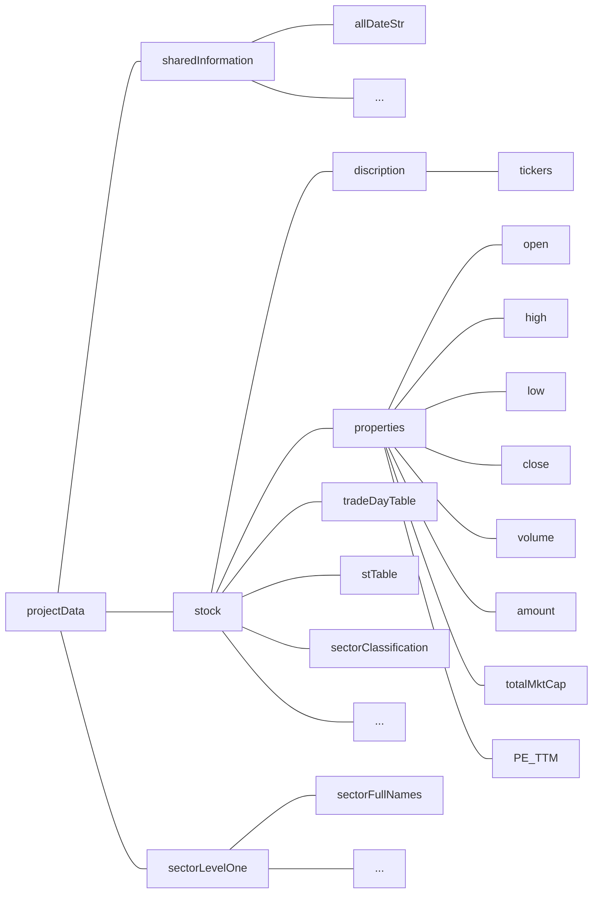

# BARRA Multi-Factor Model

Group: Fama's Friends

Members: Zhangjie LYU, Evan HU, Yuting FANG, Wei PENG, Antoine

---

## 1. Introduction

Financial investments deal with big data every day, for all the information of the market possesses the three V features - volume, variety and velocity. Variety can be reflected from the price, amount, time, ranking, analysts' reports and financial reports that all will be considered by analysts and portfolio managers. In order to understand the comprehensive and unbiased situations of the market, almost every piece of information related to what are listed above is required to be collected and analyzed, which naturally accumulates into a large volume. In addition, investment opportunities are momentary like written in water. Capturing them and making the trades, therefore, have to be as fast as possible, which is what velocity indicates. Quantitative investments, especially trading within one or two days, are one of the most common and powerful big data processing in financial investments. In this project, we implement the BARRA multi-factor model to clean stock data, establish $\alpha$ factors, test each of them separately and combine the significant and independent ones as a reference of how to form the portfolio.

## 2. Data and Database

In this project, we adopt the data from *Wind* containing the names, tickers, ohlc prices (daily open, high, low, close prices), total market capital, volumes, amounts, P/E ratios (trailing twelve month), whether they could be traded, whether they were in special treatment (ST), which industry they belong to, etc. of 3842 stocks in A share for 2166 trade days from 4 January, 2011 to 28 November, 2019. 

All these information are matrices with their columns as stocks and rows as dates. Prices, total market capital and amounts are in US dollars. Whether they could be traded and whether they were in special treatment (ST) are boolean values, with 1 as can be traded or in ST and 0 as the opposite (see Graph 1).

Graph 1. part of the stTable matrix

Each of the A share stocks is classified as one of 34 Level 1 industries. The categories are proposed by SHENWAN HONGYUAN Securities, each with an assigned number in the matrix (see Graph 2). For example, 15 represents pharmaceutical and biological industry, 18 represents real estate industry and 19 represents financial service industry.

 

As we choose MATLAB as the processing language, we store all the information matrices as a MATLAB struct in a ".mat" file (see Graph 3). Struct is a very flexible MATLAB data structure that can nest multiple layers of sub-structs and the storage of structs is very compact. 

Graph 3. the structure of the data struct

## 3. BARRA model

The BARRA multi-factor model is one of the two commonly used multi-factor models, providing countless new alpha factors with different patterns, giving remarkable annual returns.

In BARRA model, we define a factor as an element that can explain a certain characteristic of stocks and a factor exposure as the value of a certain stock on the factor. The factor return is defined as the return of a portfolio based on the factor, which mainly is established by normalizing the factor exposures cross-sectionally, longing the top 10% or 20% and shorting the bottom 10% or 20%.

There are two sets of factors already been introduced in BARRA, namely industry factors and style factors. The industry factor exposure will only be 1 (in this industry) or 0 (not in this industry) for each stock. The number of different industries, as has been mentioned above, is 34 according to the Level 1 classification of SHENWAN HONGYUAN Securities. The style factors are divided into 9 categories. They are $\beta$, momentum, size, earnings yield, volatility, growth, value, leverage and liquidity respectively. 

Assume there are $N$ stocks, $P$ industries and $Q$ styles factors at time $T$ in the market. Let $r$ denotes the $N\times{1}$ vector of returns; $r_f$ denotes the $N\times{1}$ vector of risk-free returns; $X_{Industry} = (x_n^{I_p})_{N\times P}$ are the exposures of industry factors, $x_n^{I_p}$is the exposure of stock $n$ on industry $I_p$, the value is either 0 or 1; $X_{Style} = (x_n^{S_q})_{N\times Q}$ are the exposures of different styles after normalization; $u$ are the premiums of stock returns that cannot be explained by the above factors, which are the specific returns of stocks. Then we have

$r - r_f = X_{Industry}f_{Industry} + X_{Style}f_{Style} + u.$

For all the alpha factors we implement, they will try to explain part of the specific returns $u$.