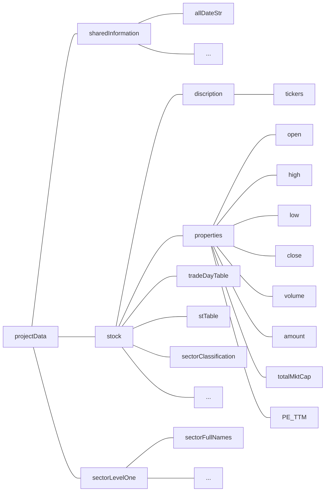

# BARRA Multi-Factor Model

Group: Fama's Friends

Members: Zhangjie LYU, Evan HU, Yuting FANG, Wei PENG, Antoine

---

## 1. Introduction

Financial investments deal with big data every day, for all the information of the market possesses the three V features - volume, variety and velocity. Variety can be reflected from the price, amount, time, ranking, analysts' reports and financial reports that all will be considered by analysts and portfolio managers. In order to understand the comprehensive and unbiased situations of the market, almost every piece of information related to what are listed above is required to be collected and analyzed, which naturally accumulates into a large volume. In addition, investment opportunities are momentary like written in water. Capturing them and making the trades, therefore, have to be as fast as possible, which is what velocity indicates. Quantitative investments, especially trading within one or two days, are one of the most common and powerful big data processing in financial investments. In this project, we implement the BARRA multi-factor model to clean stock data, establish $\alpha$ factors, test each of them separately and combine the significant and independent ones as a reference of how to form the portfolio.

## 2. Data and Database

In this project, we adopt the data from *Wind* containing the names, tickers, ohlc prices (daily open, high, low, close prices), total market capital, volumes, amounts, P/E ratios (trailing twelve month), whether they could be traded, whether they were in special treatment (ST), which industry they belong to, etc. of 3842 stocks in A share for 2166 trade days from 4 January, 2011 to 28 November, 2019. 

All these information are matrices with their columns as stocks and rows as dates. Prices, total market capital and amounts are in US dollars. Whether they could be traded and whether they were in special treatment (ST) are boolean values, with 1 as can be traded or in ST and 0 as the opposite (see Figure 1).


Figure 1. stTable matrix (part)

Each of the A share stocks is classified as one of 34 Level 1 industries. The categories are proposed by SHENWAN HONGYUAN Securities, each with an assigned number in the matrix (see Figure 2). For example, 15 represents pharmaceutical and biological industry, 18 represents real estate industry and 19 represents financial service industry.

 

Figure 2. Level 1 classification of stocks (part)

As we choose MATLAB as the processing language, we store all the information matrices as a MATLAB struct in a ".mat" file (see Figure 3). Struct is a very flexible MATLAB data structure that can nest multiple layers of sub-structs and the storage of structs is very compact. 



Figure 3. the structure of the data struct

## 3. BARRA Model

The BARRA multi-factor model is one of the two commonly used multi-factor models, providing countless new alpha factors with different patterns, giving remarkable annual returns for daily investments (T+1, trade based on yesterday's data).

In BARRA model, we define a factor as an element that can explain a certain characteristic of stocks and a factor exposure as the value of a certain stock on the factor. The factor return is defined as the return of a portfolio based on the factor, which mainly is established by normalizing the factor exposures cross-sectionally, longing the top 10% or 20% and shorting the bottom 10% or 20%.

There are two sets of factors already been introduced in BARRA, namely industry factors and style factors. The industry factor exposure will only be 1 (in this industry) or 0 (not in this industry) for each stock. The number of different industries, as has been mentioned above, is 34 according to the Level 1 classification of SHENWAN HONGYUAN Securities. The style factors are divided into 9 categories. They are $\beta$, momentum, size, earnings yield, volatility, growth, value, leverage and liquidity respectively. 

Assume there are $N$ stocks, $P$ industries and $Q$ styles factors at time $t$ in the market. Let $r_t$ denotes the $N\times{1}$ vector of returns; $X_{Industry} = (x_{n,t}^{I_p})_{N\times P}$ are the exposures of industry factors, $x_{n,t}^{I_p}$is the exposure of stock $n$ on industry $I_p$ at time $t$, the value is either 0 or 1; $X_{Style} = (x_{n,t}^{S_q})_{N\times Q}$ are the exposures of different styles after normalization; $u$ are the premiums of stock returns that cannot be explained by the above factors, which are the specific returns of stocks. Then we have

$r_t=X_{Industry}^tf_{Industry}^t+X_{Style}^tf_{Style}^t+u_t.$

For all the alpha factors we implement, they will try to explain part of the specific returns $u_t$. For every single alpha factor we find, we have

$r_t=X_{Industry}^tf_{Industry}^t+X_{Style}^tf_{Style}^t+\alpha_tf_{\alpha}^t+u_t.$

After the factor exposures are calculated, the factor return can be naturally acquired. For estimating stock returns at time $t+1$, we use the exposures at time $t$ and factor returns at time $t+1$ to run regression. For batch processing, we combine these factor exposures and returns together

$r_{t+1}=X^tf^t+u_t.$

$X^t=(X_{Industry}^t\quad{X_{Style}^t\quad \alpha^t})$, $f^t=((f_{Industry}^t)^T\quad{(f_{Style}^t)^T\quad{(f_{\alpha}^t)^T}})^T.$

For every single factor, we normalize its exposures cross-sectionally and orthogonalize them with industry factor exposures and style factor exposures. Then we add them into the $X^t$ matrix to test its significance of estimating capacity - information coefficient ($IC$). $IC$ of a factor is defined as

$IC_{\alpha}^t=corr(\mathbb{E(u_{t+1})}, u_{t+1}).$

For all the factors that pass the single factor test, we conduct a multi-factor test to ensure that the factors are not correlated with each other. If two factors have high correlation, we can synthesize them into one or choose the one with higher returns.

At last, for every $t$, we use these alpha factors to estimate the stock returns the next few days. Then we can establish the portfolio with good performances.

## 3. Project Framework

We use MATLAB as the data processing language and divide the project into several modules, as listed as follows.

1. **Setting the Configuration File**

   In this project, we implement 30 alpha factors, 34 industry factors and 10 style factors, each of which demands different market information. Therefore, we need to set a JSON configuration file to only call the information the factor needs every time instead of loading the whole dataset to process the data more efficiently.

   ```
   {   
    "alpha11":{
        "datasets":["high", "low", "close", "volume"]     
    },
    "alpha31":{
        "datasets":["high", "low", "close", "volume"]
    },
    "alpha003":{
        "datasets":["high", "low", "close"]
    },
   "alpha043":{
	     "datasets":["close", "volume"]
    }
   }
   ```
   
   Figure 4. Contents and format of "config.json" (part)
   
2. **Writing the Alpha Factor Functions**

   We choose to make the framework suitable for all circumstances, so it should be able to process the two situations - receiving data of a single date and calculating the factor exposures and returns of that day or receiving data of a certain period of time and calculating the exposures and returns throughout the period. Hence, we set the format of the factor functions as follows.

   ```{Matlab}
   function [X, offsetSize] = alpha013(alphaPara)
	% main function
	% (HIGH * LOW)^0.5 - VWAP
	% min data size: 1
	% alphaPara is a structure
        try
            high = alphaPara.high;
            low = alphaPara.low;
            vwap = alphaPara.vwap;
            updateFlag  = alphaPara.updateFlag;
        catch
            error 'para error';
        end

    % calculate and return all history factor
    % controled by updateFlag, call getAlpha if TRUE
        if ~updateFlag
            [X, offsetSize] = getAlpha(high, low, vwap);
            return
        else
            [X, offsetSize] = getAlphaUpdate(high, low, vwap);
        end
    end

    %-------------------------------------------------------------------------

    function [exposure, offsetSize] = getAlpha(high, low, vwap)
    % function compute alpha
        exposure = (high .* low)^0.5 - vwap;
        offsetSize = 1;
    end

    function [exposure, offsetSize] = getAlphaUpdate(high, low, vwap)
        offsetSize = 1;
        exposure = (high .* low)^0.5 - vwap;
    end
   ```
   
   All the information the factor needs will be stored in the struct alphaPara so that when following procedures call the factor, the function will first load the corresponding information and catch errors if the information is not found. There is a specific indicator in alphaPara which is the updateFlag. It is a boolean value that leads the function to either call the sub-function to perform the daily calculation or the calculation of a period.
   
3. **Cleaning the Data**

   ```CleanDataModule```  is a MATLAB class specially for transforming input data structure to ready-to-use data which can be processed by ```AlphaFactory``` or used separately.

   The module should be deployed with its configuration(.json) files. Several minor changes can be applied to the clean data module, please refer to [Methods](####Methods) part.
   
   
   
   **CONTENTS**
   
   [General information](####General-information)
   
   [Configuration](####Configuration)
   
   [Methods](####Methods)
   
   
   
   #### General information
   
   **Can be** working with multiple matrices with SAME size, your input MUST contain:
   
   1. at least one dummy table as stock screen rule(if no rule, use a all ones table)
   2. in configuration file, fieldnames 'A_B'  should be expressed as 'AB'
   3. avoid same fieldnames under different keys if more than one of them are referred at the same time, e.g. DON'T use names like 'f1.f2.f3' and 'f1.f4.f3' at the same time, if you wanna clean 2 tables at the same time, please rename them as 'f1.f4.f4f3'(or other names that are convenient to you) in advance
   
   **Cannot ** work with matrices with INCONSISTENT size, if you would like to add table of different size, e.g. you wanna add a index return table(of size n by 1) to stock tables(all of size n by k), please add them manually
   
   
   
   **What is doing**
   
   Generally, according to stock screen rule, screen data locally(means, use rolling window to simulate situations on different days), check corresponding location's nan, fill data if necessary, return cleaned data and selection record(a 0-1 dummy table)
   
   
   
   #### Configuration
   
   ```./cleanDataConfig```
   
   
   
   #### Methods
   
   ```R
   @CleanDataModule __ /Methods/majors
                   |__ constructor
                   |__ getStructToCleanUpdate
                   |__ getStructToCleanHistory
                   |__ getTradeableStockUpdate
                   |__ getTradeableStockHistory
                   |__ checkStructAfterSelectionUpdate
                   |__ checkStructAfterSelectionHistory
                   |__ runUpdate
                   |__ runHistory
                   
                    __ /Methods/utils
                   |__ parseStringToStructPath
                   |__ jsonDecoder
                   |__ fillDataPlugIns
                   |__ getStrcutLastRow
                   |__ saveResult
                   
                    __ /Methods/getSetPlot
                   |__ getResult
                   |__ getOHLC
                   |__ getStockScreenMatrix
                   |__ setRawSTR
                   |__ plotNumTradeableStock
                   
                    __ /configFiles
                   |__ tableNamesToSelect.json
                   |__ tradeableStocksSelectionCriteria.json
   ```
   
   
   
   The dataset contains the following data.
   
   | Item                                          | Range                                       | Frequency |
   | --------------------------------------------- | ------------------------------------------- | --------- |
   | **alpha factors**                             |                                             |           |
   | open                                          | All A share, not ST                         | daily     |
   | close                                         | All A share, not ST                         | daily     |
   | low                                           | All A share, not ST                         | daily     |
   | high                                          | All A share, not ST                         | daily     |
   | average price                                 | All A share, not ST                         | daily     |
   | volume                                        | All A share, not ST                         | daily     |
   | turnover                                      | All A share, not ST                         | daily     |
   | benchmark open                                |                                             | daily     |
   | benchmark close                               |                                             | daily     |
   | **Industry classification and style factors** |                                             |           |
   | *Industry classification*                     |                                             |           |
   | SHENWAN HONGYUAN Level 1                      | All A share, not ST                         |           |
   | *Style factors*                               |                                             |           |
   | **size**                                      |                                             |           |
   | price of shares outstanding                   | All A share, not ST                         | daily     |
   | **earnings yields**                           |                                             |           |
   | estimate EPS                                  | All A share, not ST                         |           |
   | cash earnings                                 | All A share, not ST                         | quarterly |
   | earnings TTM                                  | All A share, not ST                         | quarterly |
   | **growth**                                    |                                             |           |
   | gross revenue                                 | All A share, not ST, start from 1 Jan, 2005 | quarterly |
   | net profit attributed to the parent company   | All A share, not ST, start from 1 Jan, 2005 | quarterly |
   | **value**                                     |                                             |           |
   | total market capital                          |                                             | daily     |
   | **leverage**                                  |                                             |           |
   | long-term liabilities                         | All A share, not ST                         | quarterly |
   | total assets                                  | All A share, not ST                         | quarterly |
   | total liabilities                             | All A share, not ST                         | quarterly |
   | book equity                                   | All A share, not ST                         | quarterly |
   
   This module contains several steps.
   
4. **Alpha Factory**

   This module calculate all the factor exposures in batches using the cleaned data from the latter phase.

5. **Normalizing Exposures**

   **a.** This module receives alpha loadings from the latter phase, which is a three dimensional matrix, with its first dimension as dates, second dimension as stocks and third dimension as factors.

   **b.** This module's process contains two steps:

   - Process extreme values

     The factor loadings can be really big and away from the median, so we use Windsor method to compress the values whose absolute values are bigger than a setting value to certain ranges.

     $\begin{equation}\widetilde{x_i}=\begin{cases}x_M+n\times D_{MAD}, &{if\quad x_i>x_M+n\times D_{MAD}}\\x_M-n\times D_{MAD}, &{if\quad x_i<x_M-n\times D_{MAD}}\\x_i, &{else}\end{cases}\end{equation}$ 

     $x_i$ is the loading on stock $i$  of a factor on a single date;

     $x_M$ is the median of cross-sectional loading over stocks of the factor;

     $D_{MAD}$ is the median of the sequence $|x_i-x_M|$ .

   - Normalize

     Using z-score to normalize the processed factor loadings. Record the mean, median, skewness and kurtosis of the distribution for further examination.

   - Orthogonalize (optional)

     Use the normalized factor loadings to do regression with the style and industry factors to get the residuals. Returns the orthogonalized factor loadings.

   **c.** Class: FactorNormalization

   - Variable

     - factorCube, a three dimensional matrix, with its first dimension as dates, second dimension as stocks and third dimension as factors。
       - Already calculated.
     - styleFactorCube, a three dimensional matrix, with its first dimension as dates, second dimension as stocks and third dimension as factors.

     - industryFactorMatrix, a three dimensional matrix, with its first dimension as dates, second dimension as stocks and third dimension as industries. If one stock belongs to a certain industry, the value will be 1, otherwise it is 0.

   - Return

     - Processed (either just normalized or plus orthogonalized) three dimensional factor loadings.

   - Save

     - normFactor: the processed factor loadings;
     - orthedNormFactor: the orthogonalized processed factor loadings;
     - meanMatrix: the all-time mean of the distribution for all factors;
     - medianMatrix: the all-time median of the distribution for all factors;
     - skewnessMatrix: the all-time skewness of the distribution for all factors;
     - kurtosisMatrix: the all-time kurtosis of the distribution for all factors;
     - date.fig: the histogram of the normFactor distribution on all dates.

6. **Single Factor Testing**

   **a.**This phase uses the normalized factor exposures to run regression to acquire each factor return and test whether they are significantly effective and stable. 

   **b.**This module's process contains three steps:

   - run regression to acquire the factor return

     $r_k^{t+1}=f_{industry}^{(t)}X_{industry}^{(t)}+f_{style}^{(t)}X_{style}^{(t)}+f_{factorReturn}^{(t)}\varepsilon_k^{(t)},k=1,2,...,N$

   - test the factor return

     For each t, the alpha k has its unique $f_k$. For a given period of time, we can get time series of $f_k$. To test the validity of factors, each factor need to pass a series of statistical tests.

     1.Test the  t-statistics of the regression : test the significance and stability of factor return‘ coefficient in regression.

     - t Signaficance

     ​	$H0: mean(|t_{f_k}(T)|)=0$

     - t Stationarity

     ​	$H0:|t| > 2$   or $ADF test$: H0: the series is not stationary.

     2.Test the $f_k$ factor return : test the significance and stability of the return series of factors

     - $f_k$ Significance

     ​	$H0:mean(f_k) = 0$ or $H0:|mean(f_k)| = 0$

     - $f_k$ Stationarity

     ​	$std(f_k) = 0$ or $ADF test$

     3.Test the the IC: test the significance and stability of factors to the future expectation ability

     First calculate the IC series and then do the test.

     - IC Significance

     ​	$H0:mean(IC) = 0$ or $H0:|mean(IC)| = 0$

     - IC Stationary

        $std(IC) = 0$ or $ADF test$

     After one factor done over the below test, we can get a summary result of this factor. After whole factors done over the statistics test, we can save the whole result as a struct.

   -  plot IC and plot cum-product factor return

     plot the IC of all the factors and plot the compared factor return to see the contribution of a certain factor in this period of time. 

   **c.**Class: singleFactorTest

   - Variable
  - factorCube, a three dimensional matrix, with its first dimension as dates, second dimension as stocks and third dimension as factors after Normalizing  and Orthogonalizing process in the last step.
     - styleFactorCube, the same as last step.
     - industryFactorMatrix, the same as last step.
     - processedCloseMatrix, a two dimensional matrix, with its first dimension as dates, second dimension as stocksClosePrice.
   - Return
     - Return statistics test result of each factor as a struct and return each factor's ICplot, cumFactorReturnPlot as fig. The number of fig is the same as the location tag of factors.
   - Save
     - singleFactorReturn_testResult
     - singleFactorReturn_ICplot
     - singleFactorReturn_cumFactorReturnPlot

7. **Multi-Factor Testing**

   This module tests all the factors that pass the single factor test to eliminate collinearity and estimate future returns to determine the portfolio.

8. **Framework Structure**

   As introduced above, the whole structure of the framework is

   ```
   data   _ 00 description
         |_ 01 cleaneData
         |_ 02 styleFactor
         |_ 03 factorExposure
         |_ 04 factorNormalization
         |_ 05 singleFactorTest
   ```
   

## 4. Time Line

29 November    Practice MATLAB;

02 December    Each write 6 alpha factor functions;

​                            Code review and consensus about data cleaning details;

​							Consensus about the coding format;

06 December    Make adjustments for codes;

​						    Write industry factors and data cleaning module;

​							Write style factors: market $\beta$, momentum, volatility, CMRA, liquidity, size, E/P, DASTD;

11 December    Alpha factory module;

​							Factor normalization module;

​						    Consensus about encapsulation;

16 December    Single factor test module;

21 December    Grouping function;

​							Write the whole single factor test framework and debug.

## 5. A Few Thoughts

Conducting a complete framework for multi-factor models seems to be a basic work. Considering to make it applicable in as many circumstances as possible, however, makes it a systematic engineering to require developers to structure and restructure again and again to meet the demands.

In this project, we take into consideration these aspects:

- Able to read either single day's data streams or data of a period;
- Able to process either single day's data streams or data of a period using vectorized methods;
- Able to read data of different structures or different hierarchy designs because of decomposed input interfaces;
- Able to store either single day's factor values or values for a period;
- Able to add new alpha factors into the warehouse without changing the whole framework because the flexible configuration settings;
- Able to split the framework and apply single part of it because of excellent encapsulation, detailed annotation and demo for application of each module;
- Able for both personalized application and easy basic application due to many of the parameters that can be self-defined and default settings without omission.

Nevertheless, due to limited time, there are still aspects yet to explore, which can be considered as a future perspective of this project. Below are some of the interesting things we can look into.

- Rule of synthesis and reserve: What is the rule to solve two high correlated factors? And why?

- How to create new alpha factors: The BARRA factors are all quantitative factors hard to find economic explanations. So, how to create reasonable factors? And how to explain their effectiveness?

- Back test of grouping layers: Though, unlike Fama-French model,  it is unnecessary for BARRA models to implement this, it may still be helpful in determining the effectiveness of alpha factors on different group of stocks. Then, how many groups should we divide the stocks into? How to divide? What should we do to abnormal stocks?

- How to combine with machine learning: There are many modules of this project that can consider implementing machine learning. The grouping in the back test can be connected with machine learning in both supervised and unsupervised classification and clustering. The grouping function has taken into consideration many circumstances, but how to set interfaces for machine learning method is still yet to develop.

  ```
  function groupedCube = grouping(factorCube, mktSize, groupRule)
  % GROUPING returns the Cube of the rank for stocks under the scoring points
  %   of each factor under certain rules.
  % factorCube is the raw m x n x l cube with its first dimension as dates, 
  %   second dimension as stocks and third dimension as factors.
  % mktSize is a m x n matrix with its first dimension as dates and second dimension
  %   as stocks, the values in it are the sizes of companies on different dates.
  % groupRule is a struct with rules for the grouping.
  % groupRule.delOpt = {method, value}, default = {'percent', 0.3} is a cell
  %   if method is 'percent', then value should be in [0, 1] as the
  %       percentage of the smallest sizes that we drop;
  %   if method is 'threshold', then value should be the threshold if the
  %       sizes of the stock is smaller than which then we drop;
  % groupRule.bracket = {nLayer, method}, default = {5, {'quantile', [0.2, 
  % 0.2, 0.2, 0.2, 0.2]}} is a cell
  %   nLayer is the number of layers we need to group into;
  %   method is a cell to determine the method for grouping
  %       if method{1} is 'quantile', method{2} inputs the percent of each
  %           group;
  %       if method{1} is 'threshold', method{2} inputs the thresholds for
  %           each group;
  % groupRule.reserveOpt = 0/1, default is 0 is a boolean
  %   0 means stocks with NaN value will not be considered in the grouping;
  %   1 means stocks with NaN value will be considered in the grouping.
  ```
  
  Figure 5. Settings for the grouping function
  
  Moreover, the establishment of new alpha factors can also be achieved through this method. Hence, what models of machine learning can be applied? Which features are important? How to reach a better fine-tuning?

What we have seen in this project is an even larger world of unknown for us, and these thoughts are precious because they give us directions.